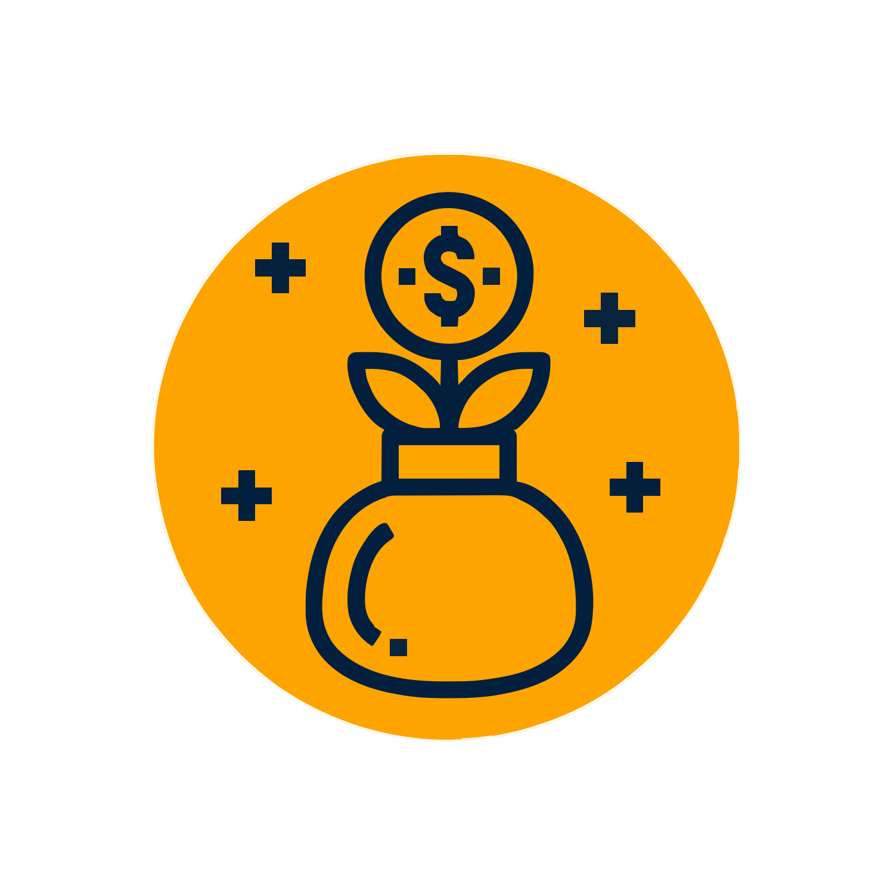

<!-- Don't delete it -->
<div name="readme-top"></div>

<!-- Organization Logo -->
<div align="center">
  
  &nbsp;&nbsp;&nbsp;
  
  &nbsp;&nbsp;&nbsp;
  
</div>

&nbsp;

<!-- Organization Name -->
<div align="center">

[](https://bene-evm.stability.nexus/)

</div>

<!-- Social Links -->
<p align="center">
<a href="https://t.me/StabilityNexus">
</a>
&nbsp;&nbsp;
<a href="https://x.com/StabilityNexus">
</a>
&nbsp;&nbsp;
<a href="https://discord.gg/YzDKeEfWtS">
</a>
&nbsp;&nbsp;
<a href="https://news.stability.nexus/">
</a>
&nbsp;&nbsp;
<a href="https://linkedin.com/company/stability-nexus">
</a>
&nbsp;&nbsp;
<a href="https://www.youtube.com/@StabilityNexus">
</a>
</p>

&nbsp;

<!-- Project core values -->
<p align="center">
  <strong>
    Bene allows project owners to raise funds for their projects and to reward funders with Proof-of-Funding tokens.
  </strong>
</p>

---

# Bene-Fundraising-EVM-Frontend

This repository contains the **frontend interface** for interacting with Bene’s EVM-based fundraising contracts.

### 👉 Smart Contract Repository:
https://github.com/StabilityNexus/Bene-FundRaising-EVM-Contracts  

### 👉 Live Frontend Deployment:
https://bene-evm.stability.nexus/

This application enables a smooth, user-friendly experience for funders and project owners.

---

## 🚀 Running This Frontend Locally

Follow the steps below to run Bene's frontend on your machine.

### 1. Clone the Repository
```bash
git clone https://github.com/StabilityNexus/Bene-FundRaising-EVM-Frontend
cd Bene-FundRaising-EVM-Frontend
```

### 2. Install Dependencies
```bash
npm install
```

### 3. Start the Development Server
```bash
npm run dev
```

The frontend will be available at:

👉 http://localhost:5173/

---

## 📬 Support & Community

If you have questions, want to contribute, or need help:

- Discord: https://discord.gg/YzDKeEfWtS  
- Documentation: https://docs.stability.nexus/  

We welcome improvements and contributions!

---

© 2025 The Stable Order
